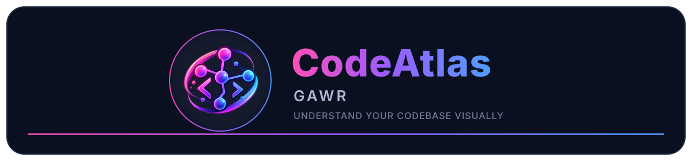
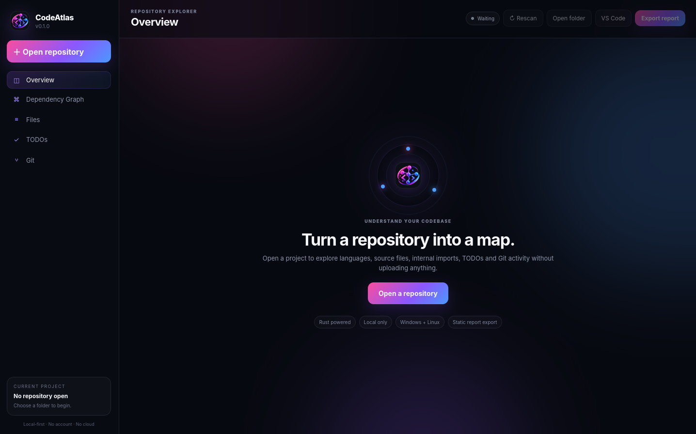
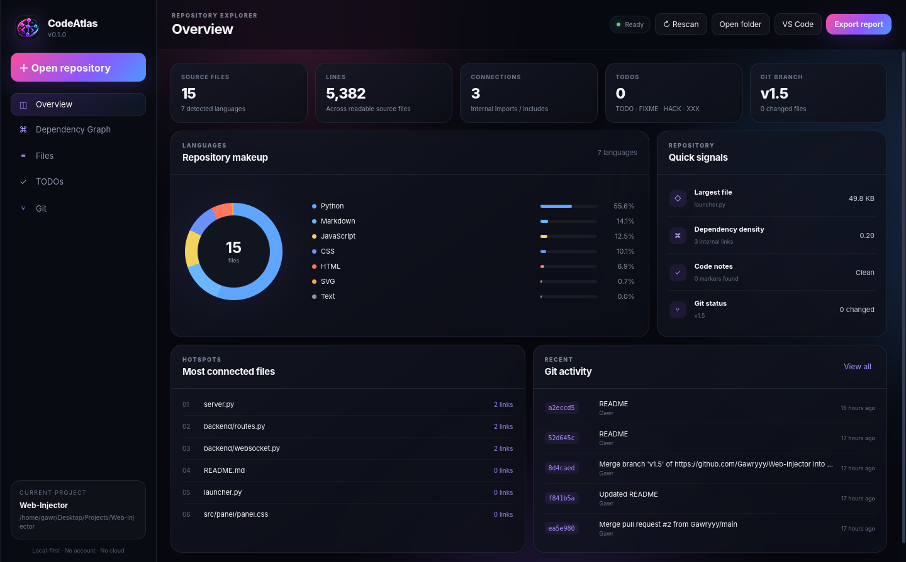
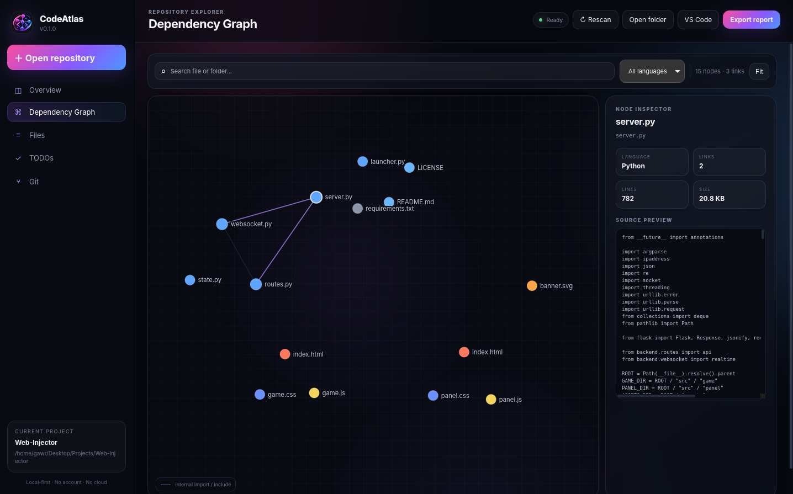
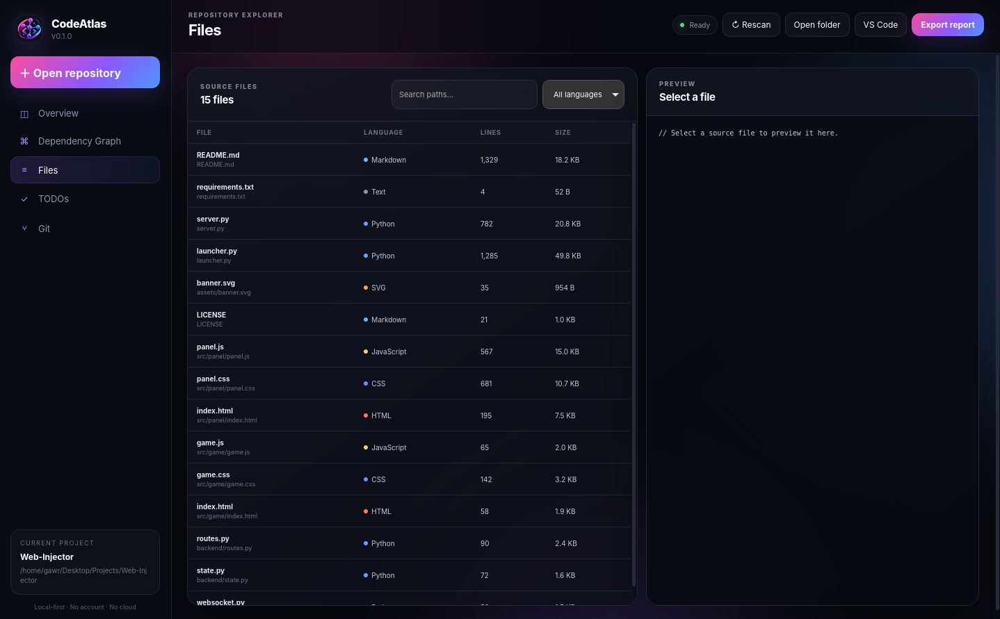
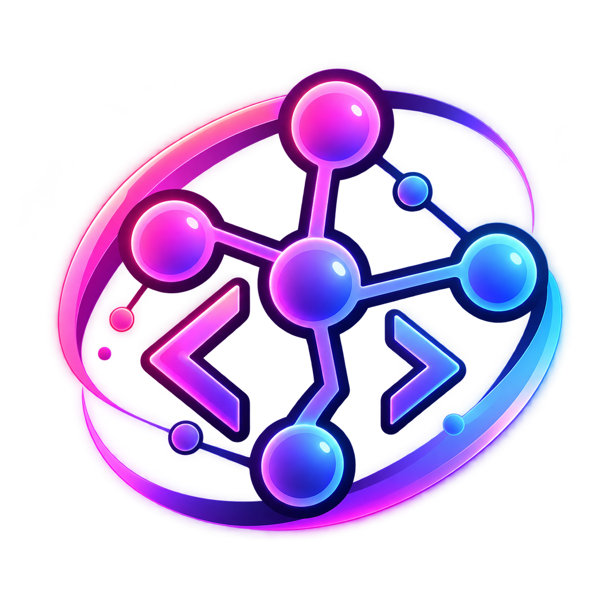

<p align="center">
  
</p>

<p align="center">
  <a href="#overview">
    
  </a>
  <a href="#features">
    
  </a>
  <a href="#setup">
    
  </a>
  <a href="#running-codeatlas">
    
  </a>
  <a href="#building">
    
  </a>
  <a href="#previews">
    
  </a>
  <a href="#project-structure">
    
  </a>
</p>

<p align="center">
  
  
  
  
  
  
</p>

<p align="center">
  <strong>A fast, local-first visual repository explorer.</strong><br>
  Explore dependencies, files, languages, TODOs, Git activity and repository structure without uploading your code.
</p>

---

<a id="overview"></a>

# Overview

**CodeAtlas** turns a source-code repository into an interactive visual map.

Choose a project folder and CodeAtlas scans it locally, detects source files and languages, resolves supported internal dependencies, finds TODO-style comments and reads Git information. The result is presented through a native desktop interface built with **Rust + Tauri 2 + vanilla HTML/CSS/JavaScript**.

CodeAtlas is designed to be:

- **Local-first** — project contents stay on your machine.
- **Cross-platform** — Linux and Windows are supported.
- **Fast** — repository scanning and analysis are handled by Rust.
- **Visual** — understand how files connect instead of only browsing a file tree.
- **Simple to build** — no React, Electron or frontend package manager is required.

---

<a id="features"></a>

# Features

### Interactive dependency graph

Explore local dependencies as a visual graph with:

- Pan and zoom
- Draggable nodes
- Click-to-inspect files
- Language filtering
- Search
- Connected-file highlighting
- Repository hotspot discovery

### Repository overview

CodeAtlas shows useful project statistics such as:

- Source-file count
- Source lines
- Dependency links
- Language breakdown
- Code notes
- Most connected files

### Source browser

Browse detected project files without leaving CodeAtlas:

- Search by filename
- Filter by language
- Preview source code
- Jump between analyzed files
- Open the repository in VS Code

### TODO browser

CodeAtlas detects common code-note markers:

```text
TODO
FIXME
HACK
XXX
```

This makes it easier to find unfinished work across a repository.

### Git integration

When Git is installed and the selected folder is a Git repository, CodeAtlas can show:

- Current branch
- Changed-file count
- Recent commits
- Commit hash
- Author
- Commit subject
- Relative commit time

Git support is optional. The rest of CodeAtlas still works without it.

### Static reports

Export a standalone HTML report containing repository information that can be viewed without running CodeAtlas.

### Supported languages

CodeAtlas recognizes common source and configuration files including:

```text
Rust
Python
JavaScript
TypeScript
JSX / TSX
C
C++
PHP
HTML
CSS / SCSS
JSON
TOML
YAML
Markdown
Java
Kotlin
Go
C#
Shell
SQL
Vue
Svelte
```

Dependency resolution in v0.1.0 focuses on internal/local references for:

```text
JavaScript / TypeScript
Python
C / C++
Rust
PHP
```

---

<a id="setup"></a>

# Setup

## Linux / Kubuntu / Ubuntu

### 1. Install Linux dependencies

CodeAtlas includes an installation script for the system libraries required by Tauri:

```bash
chmod +x scripts/install-kubuntu-deps.sh
./scripts/install-kubuntu-deps.sh
```

The script installs:

```text
libwebkit2gtk-4.1-dev
build-essential
curl
wget
file
libxdo-dev
libssl-dev
libayatana-appindicator3-dev
librsvg2-dev
```

### 2. Install Rust

If Rust is not installed yet:

```bash
curl --proto '=https' --tlsv1.2 -sSf https://sh.rustup.rs | sh
source "$HOME/.cargo/env"
```

Check that it works:

```bash
rustc --version
cargo --version
```

### 3. Install the Tauri CLI

```bash
cargo install tauri-cli --version "^2" --locked
```

Check it:

```bash
cargo tauri --version
```

---

## Windows

### 1. Install Rust

Install Rust using **rustup**.

After installation, open a new PowerShell window and check:

```powershell
rustc --version
cargo --version
```

### 2. Install Microsoft C++ Build Tools

Install **Microsoft Visual Studio Build Tools** and enable:

```text
Desktop development with C++
```

### 3. Make sure WebView2 is available

CodeAtlas uses Tauri, which uses Microsoft Edge WebView2 on Windows.

Modern Windows 10/11 systems normally already include WebView2. If it is missing, install the Microsoft WebView2 Runtime.

### 4. Install the Tauri CLI

```powershell
cargo install tauri-cli --version "^2" --locked
```

Check it:

```powershell
cargo tauri --version
```

---

<a id="running-codeatlas"></a>

# Running CodeAtlas

## Linux

From the CodeAtlas project folder:

```bash
chmod +x scripts/dev-linux.sh
./scripts/dev-linux.sh
```

The script automatically copies:

```text
assets/logo/logo.png
```

into the Tauri frontend assets and then launches:

```bash
cargo tauri dev
```

If Cargo is not found in a new terminal:

```bash
source "$HOME/.cargo/env"
./scripts/dev-linux.sh
```

You can also run Tauri directly:

```bash
cargo tauri dev
```

If you run Tauri directly, make sure the frontend logo already exists at:

```text
src/assets/logo/logo.png
```

---

## Windows

Open PowerShell in the CodeAtlas project folder and run:

```powershell
.\scripts\dev-windows.ps1
```

The script copies the main CodeAtlas logo into the frontend and then launches:

```powershell
cargo tauri dev
```

---

# Using CodeAtlas

1. Launch CodeAtlas.
2. Click **Open repository**.
3. Select a project folder.
4. Wait for the local scan to complete.
5. Use the sidebar to explore the repository.

The main views are:

```text
Overview
Dependency Graph
Files
TODOs
Git
```

## Dependency Graph controls

- **Mouse wheel** — zoom
- **Drag background** — pan
- **Drag node** — move a file
- **Click node** — inspect the file
- **Search** — reduce the visible graph
- **Language filter** — show only matching files

For responsiveness, the graph view displays up to **260 matching nodes** at once. Repository statistics and the file browser still include all scanned source files.

## Open in VS Code

CodeAtlas can use the `code` command to open the active repository in Visual Studio Code.

If the button does nothing, make sure this works in your terminal:

```bash
code .
```

---

<a id="building"></a>

# Building

## Linux — `.deb` + `.AppImage`

Run:

```bash
chmod +x scripts/build-linux.sh
./scripts/build-linux.sh
```

The script syncs the CodeAtlas logo and executes:

```bash
cargo tauri build --bundles deb,appimage
```

Build output is placed under:

```text
src-tauri/target/release/bundle/
```

Typical output:

```text
src-tauri/target/release/bundle/
├── deb/
│   └── CodeAtlas_*.deb
└── appimage/
    └── CodeAtlas_*.AppImage
```

### Install the `.deb`

```bash
sudo apt install ./src-tauri/target/release/bundle/deb/*.deb
```

The `.AppImage` can be made executable and launched directly:

```bash
chmod +x src-tauri/target/release/bundle/appimage/*.AppImage
./src-tauri/target/release/bundle/appimage/*.AppImage
```

---

## Windows — NSIS `.exe`

Run from PowerShell:

```powershell
.\scripts\build-windows.ps1
```

The script syncs the CodeAtlas logo and executes:

```powershell
cargo tauri build --bundles nsis
```

The installer is created under:

```text
src-tauri\target\release\bundle\nsis\
```

You can distribute the generated `.exe` installer through a GitHub Release.

---

<a id="previews"></a>

# Previews

## CodeAtlas

<p align="center">
  
</p>

## Repository overview + dependency graph

<p align="center">
  
  
</p>

## Files

<p align="center">
  
</p>

---

<a id="project-structure"></a>

# Project Structure

```text
CodeAtlas/
├── .github/
│   └── workflows/
│       └── build.yml
│
├── assets/
│   ├── logo/
│   │   └── logo.png
│   ├── previews/
│   │   ├── CodeAtlas.png
│   │   ├── deps.png
│   │   ├── FIles.png
│   │   └── OverView.png
│   └── banner.svg
│
├── scripts/
│   ├── install-kubuntu-deps.sh
│   ├── dev-linux.sh
│   ├── build-linux.sh
│   ├── dev-windows.ps1
│   └── build-windows.ps1
│
├── src/
│   ├── assets/
│   │   └── logo/
│   │       └── logo.png
│   ├── index.html
│   ├── styles.css
│   └── app.js
│
├── src-tauri/
│   ├── capabilities/
│   │   └── default.json
│   ├── icons/
│   ├── src/
│   │   ├── lib.rs
│   │   └── main.rs
│   ├── Cargo.toml
│   ├── build.rs
│   └── tauri.conf.json
│
├── .gitignore
├── CHANGELOG.md
├── CONTRIBUTING.md
├── LICENSE
└── README.md
```

---

# How It Works

CodeAtlas uses a small web frontend inside a native Tauri desktop shell.

```text
┌──────────────────────────────────────────────┐
│                  CodeAtlas                   │
├──────────────────────────────────────────────┤
│ HTML / CSS / JavaScript UI                   │
│                  │                           │
│                  ▼                           │
│             Tauri invoke                     │
│                  │                           │
│                  ▼                           │
│              Rust backend                    │
│                  │                           │
│      ┌───────────┼─────────────┐             │
│      ▼           ▼             ▼             │
│ File scan   Dependency     Git commands       │
│             analysis                          │
└──────────────────────────────────────────────┘
```

## Frontend

The UI is built with:

```text
HTML
CSS
JavaScript
```

There is no React, Electron, Node frontend server or npm build step.

Tauri exposes Rust commands to JavaScript using:

```text
window.__TAURI__.core.invoke
```

## Rust backend

The Rust side handles:

- Folder selection
- Repository walking
- `.gitignore`-aware filtering
- Language detection
- Import/include extraction
- Internal dependency resolution
- TODO scanning
- Git integration
- Source-file preview
- Static report generation
- Operating-system integration

## Dependency detection

CodeAtlas can recognize local references such as:

```js
import thing from "./thing.js";
```

```python
from app.utils import helper
```

```cpp
#include "renderer.hpp"
```

```rust
mod parser;
use crate::scanner::walk;
```

```php
require "./config.php";
```

When the referenced file exists inside the selected repository, CodeAtlas can create a graph edge between the files.

---

# Privacy

CodeAtlas is designed to be **local-first**.

Repository scanning, dependency analysis, file previews and report generation happen on the computer running CodeAtlas.

The application does not require:

```text
An account
A database
A cloud service
A repository upload
Analytics
```

Your source code does not need to leave your machine for CodeAtlas to analyze it.

---

# GitHub Actions

The repository includes:

```text
.github/workflows/build.yml
```

The workflow can build:

```text
Linux
├── .deb
└── .AppImage

Windows
└── NSIS .exe
```

It runs when:

- The workflow is started manually from GitHub Actions.
- A Git tag matching `v*` is pushed.

Example:

```bash
git tag v0.1.0
git push origin v0.1.0
```

After the workflow finishes, the installers can be downloaded from the workflow artifacts and attached to a GitHub Release.

---

# Current v0.1 Limitations

CodeAtlas currently uses lightweight static analysis instead of running a complete compiler/parser for every supported language.

Because of that:

- Dynamic imports may not always resolve.
- TypeScript path aliases are not resolved yet.
- Macro-generated Rust modules may not be fully understood.
- C/C++ include paths configured only through a build system may not resolve.
- Very large or binary files are skipped from source analysis.
- The dependency graph limits the visible node set for performance.

These limitations are good areas for future improvements and contributions.

---

# Roadmap

Ideas for future CodeAtlas versions:

- Tree-sitter / AST-based parsers
- Circular dependency detection
- Duplicate-code detection
- Function-level dependency graphs
- Class-level dependency graphs
- Git commit comparison
- Repository health score
- Full source-content search
- Custom ignore rules
- SVG / PNG graph export
- Direct GitHub repository cloning
- Plugin system for custom analyzers
- Better large-repository graph clustering
- Animated dependency tracing
- Dark/light theme switching

---

# Troubleshooting

### `cargo: command not found`

Linux:

```bash
source "$HOME/.cargo/env"
```

Then try again:

```bash
cargo --version
```

### `cargo tauri` is not available

Install the Tauri CLI:

```bash
cargo install tauri-cli --version "^2" --locked
```

### Linux build complains about WebKitGTK

Run:

```bash
./scripts/install-kubuntu-deps.sh
```

### The CodeAtlas logo is missing

Make sure this file exists:

```text
assets/logo/logo.png
```

Then run CodeAtlas using the provided script:

```bash
./scripts/dev-linux.sh
```

On Windows:

```powershell
.\scripts\dev-windows.ps1
```

### Git information is empty

Make sure:

```bash
git --version
```

works and that the selected project is a Git repository.

### VS Code does not open

Make sure the VS Code command-line launcher is available:

```bash
code --version
```

---

# Contributing

Contributions, issues and pull requests are welcome.

When contributing, try to keep CodeAtlas:

- Local-first
- Cross-platform
- Fast
- Safe with malformed/unusual source files
- Usable on both Linux and Windows
- Easy to build without a complicated frontend toolchain

See:

```text
CONTRIBUTING.md
```

for additional project information.

---

# License

CodeAtlas is released under the **MIT License**.

See [LICENSE](LICENSE).

---

<p align="center">
  
</p>

<p align="center">
  <strong>CodeAtlas</strong><br>
  <sub>by Gawr · Understand your codebase visually.</sub>
</p>
